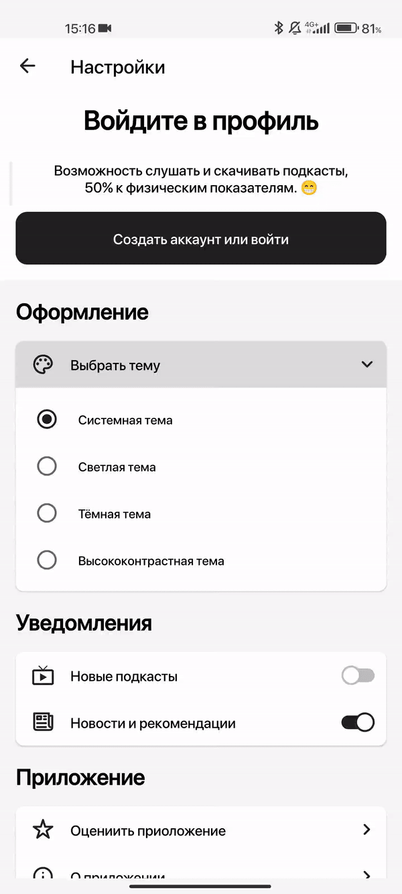

# RD Compose

Приложение по поиску городов России.
> Разработка заморожена на неопределённый срок.

# Используемые технологии:

* Модульный проект. 🔠
* Like TEA подход к организации UI слоя. 🔭🌌🌠🪐✨
* Чистая архитектура. 🙈
* Jetpack Compose. 🤖
* Coroutines Flow. ♨️
* Dagger Hilt. 🗡️
* Room, Compose DataStore. 💽
* Compose Navigation. 🗺️

***

  
  
  

  
  

